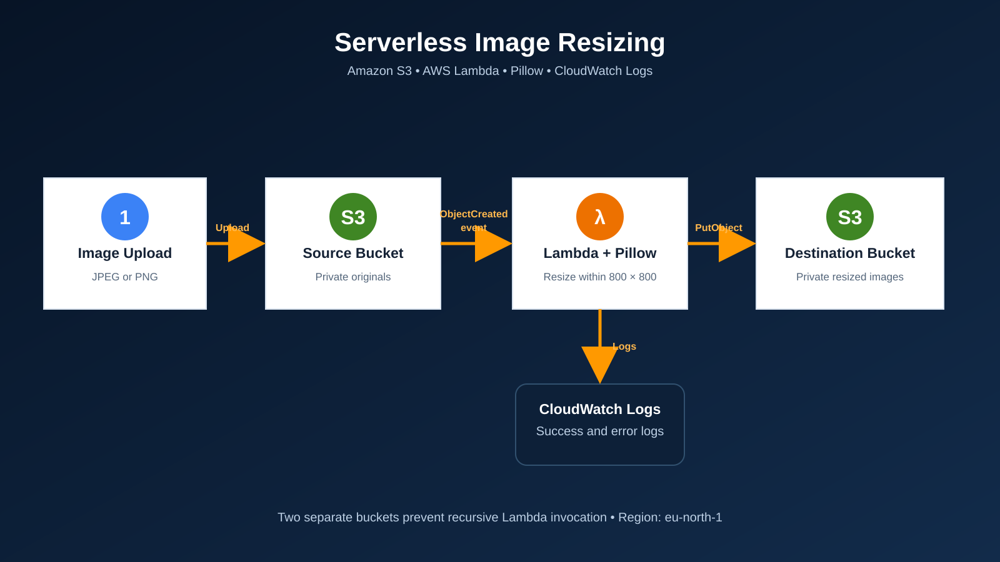

# Serverless Image Resizing with Amazon S3 and AWS Lambda

**Author:** [Muhammad Luqman](https://github.com/Muahmmad-Luqman)  
**Region used:** Europe (Stockholm) — `eu-north-1`  
**Status:** Learning project

## Overview

This project automatically resizes JPEG and PNG images. Uploading an image to a private source S3 bucket invokes an AWS Lambda function. The function downloads the image, resizes it with Pillow while preserving its aspect ratio, and saves the result in a separate private destination bucket.

Source bucket: `YOUR-SOURCE-BUCKET`  
Destination bucket: `YOUR-DESTINATION-BUCKET`

## Architecture



1. A user uploads an image to the source bucket.
2. Amazon S3 sends an `ObjectCreated` event to Lambda.
3. Lambda reads the source object and resizes it with Pillow.
4. Lambda writes the output to `resized/<original-key>` in the destination bucket.
5. Lambda sends execution logs to Amazon CloudWatch Logs.

The two-bucket design prevents the output from invoking the same function again.

## AWS services

| Service | Purpose |
|---|---|
| Amazon S3 | Stores original and resized images |
| AWS Lambda | Runs the image-resizing code without managing a server |
| AWS IAM | Grants least-privilege source-read and destination-write access |
| Amazon CloudWatch Logs | Records invocation information and errors |

## Project files

- `src/lambda_function.py` — Lambda handler and image-processing logic.
- `requirements.txt` — pinned Pillow dependency.
- `scripts/build-layer.sh` — creates a Python 3.12 x86_64 Pillow layer ZIP.
- `scripts/build-package.sh` — optional all-in-one Python 3.12 x86_64 deployment ZIP.
- `iam/lambda-s3-policy.json` — bucket-scoped IAM permissions.
- `docs/BEGINNER_GUIDE.md` — detailed console instructions, tests and cleanup.
- `docs/architecture.svg` — editable architecture diagram.
- `tests/test_resize.py` — small local image-processing tests.

## Configuration

| Environment variable | Reference value | Purpose |
|---|---:|---|
| `DESTINATION_BUCKET` | `YOUR-DESTINATION-BUCKET` | Output bucket |
| `OUTPUT_PREFIX` | `resized` | Output key prefix |
| `MAX_WIDTH` | `800` | Maximum output width |
| `MAX_HEIGHT` | `800` | Maximum output height |
| `JPEG_QUALITY` | `85` | JPEG quality from 1 to 95 |
| `MAX_INPUT_BYTES` | `10485760` | Rejects inputs above 10 MiB |

## Supported files

- `.jpg`
- `.jpeg`
- `.png`

Other objects are skipped and recorded in the logs. The function corrects EXIF orientation and never stretches an image beyond its original aspect ratio.

## Deployment

Follow the complete [beginner AWS Console guide](docs/BEGINNER_GUIDE.md). The verified project configuration uses **Python 3.12**, **x86_64**, and a separate Pillow Lambda Layer. Attach a compatible CPython 3.12 x86_64 layer before deploying `lambda_function.py`.

## Verification

Upload a JPEG or PNG to the source bucket, wait a few seconds, and check the destination bucket for:

```text
resized/<original-file-name>
```

Confirm that the output dimensions are no greater than 800 × 800 and check the Lambda `Monitor` tab for errors.

## Security

- Both buckets should keep **Block all public access** enabled.
- The Lambda role can read only source objects and write only destination objects.
- No AWS credentials, access keys or secrets are stored in this repository.
- Add KMS permissions if either bucket uses a customer-managed KMS key.

## Cost and cleanup

This project may create charges for S3 storage and requests, Lambda invocations and duration, and CloudWatch Logs. Free Tier eligibility depends on the account. Delete the S3 trigger before deleting the function, empty both lab buckets, delete the buckets if no longer needed, delete the Lambda function and role, and remove its CloudWatch log group.

## Validation status

The Python file compiles, the resize unit tests pass locally, and the IAM JSON is syntactically valid. The author reports that the project worked after selecting Python 3.12 with the compatible Pillow layer. Public files use placeholders instead of real bucket names or account identifiers. The original AWS console configuration and live invocation were not independently inspected for this repository.

## References

- [AWS tutorial: S3 trigger with Lambda](https://docs.aws.amazon.com/lambda/latest/dg/with-s3-example.html)
- [AWS Lambda Python ZIP packages](https://docs.aws.amazon.com/lambda/latest/dg/python-package.html)
- [Managing Lambda layers](https://docs.aws.amazon.com/lambda/latest/dg/chapter-layers.html)
- [Process S3 event notifications with Lambda](https://docs.aws.amazon.com/lambda/latest/dg/with-s3.html)
- [Pillow documentation](https://pillow.readthedocs.io/)

Documentation reviewed: 21 September 2026.
